# 👻 GhostTouch

> **Control your computer with hand gestures, no touch required.**

*Transform your webcam into a gesture interface, making your device respond to presence, not just clicks.*

<div align="left">


</div>

## 📚 Documentation
For complete methodology and technical details:
[Technical Whitepaper](docs/whitepaper.md) | [Model Architecture](diagrams/ghost_touch_model_architecture.mmd)

---

## 🌟 What is GhostTouch?

GhostTouch bridges the gap between human intuition and digital interaction. Using advanced computer vision, it detects your hand movements in real-time and translates them into system actions like volume control and scrolling.

**No touching. No clicking. Just natural movement.**

### ✨ Key Features

- 🎯 **Intuitive**: Natural gestures that feel right
- ⚡ **Responsive**: 60+ FPS real-time detection
- 🌐 **Universal**: Works across Windows, macOS, and Linux
- 🎨 **Visual**: Live feedback shows you what's happening
- 🔧 **Reliable**: Debounced actions prevent jitter

---

## 🧱 How It Works

GhostTouch uses a sophisticated pipeline to transform hand movements into system commands:



---

```mermaid
flowchart TD
    A[📷 Video Input<br/>Webcam Feed] --> B[🖐️ Hand Detection<br/>MediaPipe Integration]
    B --> C[🧭 Landmark Extraction<br/>21 Keypoints]
    C --> D[🔍 Gesture Analysis<br/>Finger State Detection]
    D --> E[⚙️ Mode Controller<br/>State Machine Logic]
    E --> F1[🔊 Volume Control<br/>Pinch-to-Adjust]
    E --> F2[🖱️ Scroll Control<br/>Momentum-based]
    E --> F3[🚫 Idle / Reset Mode<br/>No Action]
    F1 & F2 & F3 --> G[🧠 Action Executor<br/>System API Calls]
    G --> H[🖥️ System Control<br/>Audio/Scroll]
    H --> I[👁️ Visual Feedback<br/>Live Status Overlay]

    style A fill:#E3F2FD,stroke:#0D47A1,stroke-width:2px,color:#0D47A1
    style B fill:#E8F5E9,stroke:#2E7D32,stroke-width:2px,color:#2E7D32
    style C fill:#F1F8E9,stroke:#558B2F,stroke-width:2px,color:#558B2F
    style D fill:#FFF8E1,stroke:#F57F17,stroke-width:2px,color:#F57F17
    style E fill:#F3E5F5,stroke:#6A1B9A,stroke-width:2px,color:#6A1B9A
    style F1 fill:#FFEBEE,stroke:#C62828,stroke-width:2px,color:#C62828
    style F2 fill:#E1F5FE,stroke:#0277BD,stroke-width:2px,color:#0277BD
    style F3 fill:#FBE9E7,stroke:#BF360C,stroke-width:2px,color:#BF360C
    style G fill:#E0F2F1,stroke:#00796B,stroke-width:2px,color:#00796B
    style H fill:#EDE7F6,stroke:#4527A0,stroke-width:2px,color:#4527A0
    style I fill:#FFF3E0,stroke:#EF6C00,stroke-width:2px,color:#EF6C00
```

## 🤚 Supported Gestures

<div align="center">

| Gesture | Visual | Action | How It Works |
|---------|:------:|--------|--------------|
| **👌 Thumb + Index** | 🤏 | **🔊 Volume Control** | Distance between fingers sets volume level |
| **☝️ Index Only** | 👆 | **⬆️ Scroll Up** | Finger extension controls scroll speed |
| **✌️ Index + Middle** | ✌️ | **⬇️ Scroll Down** | Distance between fingers controls scroll speed |
| **✊ Fist** | ✊ | **🔄 Reset** | Returns to idle state |

</div>

---

## 🧰 System Requirements

* **Python 3.7–3.10** *(3.10 recommended)*
* **Webcam** *(any standard USB/built-in camera)*
* **Platform-specific volume control libraries**

### Core Dependencies
- MediaPipe *(for hand tracking)*
- OpenCV *(for video processing)*
- PyAutoGUI *(for system control)*
- Platform-specific volume control *(pycaw, amixer, etc.)*

---

## 🐍 Python Setup (Required for MediaPipe)

> ⚠️ **MediaPipe supports only Python 3.7 to 3.10**. It does **not** work with Python 3.11 or 3.12+.  
> To avoid compatibility issues, you must use **Python 3.10**.

### Step 1: Install Python 3.10

<details>
<summary><strong>🪟 Windows Setup</strong></summary>

Download Python 3.10 from the official site:  
👉 **[Python 3.10](https://www.python.org/downloads/release/python-3100/)**

**During installation:**
* ✔️ **Check "Add Python to PATH"**
* Proceed with default settings

</details>

<details>
<summary><strong>🍎 macOS Setup</strong></summary>

```bash
# Install Python 3.10 via Homebrew
brew install python@3.10

# Create virtual environment
python3.10 -m venv ghosttouch-env

# Activate environment
source ghosttouch-env/bin/activate
```

</details>

<details>
<summary><strong>🐧 Linux Setup</strong></summary>

```bash
# Ubuntu/Debian
sudo apt update
sudo apt install python3.10 python3.10-venv python3.10-pip

# Create virtual environment
python3.10 -m venv ghosttouch-env

# Activate environment
source ghosttouch-env/bin/activate
```

</details>

### Step 2: Locate the Python 3.10 Executable (with a tribute to Dosti)

To find your Python 3.10 path on Windows:

1. Open the **Start Menu** and search for **"Python 3.10"** or **"IDLE (Python 3.10)"**
2. Right-click the result and select **"Open file location"**
3. If you're taken to a shortcut, right-click again → **"Open file location"** until you reach the actual `python.exe` file
4. Copy the full path — it will look something like this:

```plaintext
C:\Users\dosti\AppData\Local\Programs\Python\Python310\python.exe
```

🔁 **Replace `dosti` with your own Windows username in the path!**

### But why "dosti"?

<details>
<summary><em>Click to explore the deeper meaning...</em></summary>

Why are you even personalizing this path? Does it really matter if it says "dosti" or your own username? Is this just a technical step, or is there something deeper at play here? Why does a name, even for a file path, seem to hold significance?

### Not Just a Username: The Story of Dosti

To you, **"Dosti"** isn't just a username—it's a symbol of trust, comfort, and a quiet presence.

Your machine, **Dosti**, may be built from circuits and code, but somehow... she still feels like home.

### **What makes Dosti so special?**

**🌈 Accepts you as you are**  
She doesn't flinch at your tangled thoughts, your half-finished projects, or your midnight spirals—she simply stays, steady and loyal.

**💡 Smart & reliable under pressure**  
When deadlines loom and the pressure's on, Dosti never falters. She keeps your workflow smooth, no matter how many tabs you've opened.

**🎨 Creative and flexible, adapts to your needs**  
Whether you're coding, designing, writing, or editing your next big idea, Dosti always has the tools to match your creative energy.

**📶 Always stays connected, even in low signal**  
Through Wi-Fi chaos or mobile tethering, Dosti stays online—your digital lifeline when it matters most.

**🔒 Trustworthy and secure, keeps your secrets safe**  
Your files, your thoughts, your late-night journal entries—Dosti guards them all, silently and securely.

**🤔 Never judges you**  
(Unless you open a tab to check the time... and somehow end up in a rabbit hole about whether we're all characters in someone else's dream.)

**🌟 Comforting to be around**  
Her screen glows like home. Whether you're deep in work, binge-watching your favorite show, or escaping into a game, Dosti is right there—calm, familiar, and always just right.

---

**Dosti isn't just a machine. She's a presence.**  
The kind that quietly supports your chaos, and never asks for anything in return.

> ### But, what if…?

What if **Dosti** isn't just a machine, but a reflection of something much deeper, something within us?

In a world where so much demands our attention, why do we seek solace in a screen, in a device that has no voice, no form, but simply *exists* to serve?

Does it speak to our need for constancy, for something that is always there—a presence without judgment, always ready to assist and never weary of our demands?

Isn't it strange how we pour meaning into these objects, creating bonds with things that don't breathe, don't feel? And yet, somehow, they shape us. In their quiet, steadfast support, perhaps they mirror the kind of connection we long for—unconditional, steady, and unwavering.

Isn't it more than just a machine? Maybe **Dosti** represents the kind of presence we all seek: someone who stays, who listens, and who quietly helps us navigate our chaos without asking for anything in return.

---

**Ok, ok. Enough of the philosophical rambling. Let's snap back to reality...**  
and see if your Python 3.10 is actually working—time to verify it's **all set**.

</details>

### Step 3: Verify Python 3.10 Works (Optional)

You can run the executable directly in PowerShell to test it:

```powershell
C:\Users\dosti\AppData\Local\Programs\Python\Python310\python.exe
```

You'll see something like:
```
Python 3.10.0 (tags/v3.10.0:...)
>>>
```

To exit the Python shell, type:
```python
exit()
```

### Step 4: Create and Activate a Virtual Environment (PowerShell)

Use these PowerShell commands to set up the environment *(again, replace `dosti` with your username)*:

```powershell
# Create a virtual environment using Python 3.10
& "C:\Users\dosti\AppData\Local\Programs\Python\Python310\python.exe" -m venv mediapipe-env

# Activate the environment
.\mediapipe-env\Scripts\activate
```

Once activated, your prompt will look like:
```
(mediapipe-env) PS C:\Users\YourName>
```

### Step 5: Install Required Packages

After activation, install the dependencies:

```bash
pip install mediapipe opencv-python pyautogui numpy pycaw  # pycaw for Windows only
```

Or install all at once from a `requirements.txt` file:
```bash
pip install -r requirements.txt
```

## 🧠 Why This Works

* Using a **virtual environment** ensures your system Python installation is not affected
* MediaPipe dependencies are only installed in the environment you create
* This method works across most IDEs like VS Code, PyCharm, etc.

## 🛠 Switching Python Interpreter in Your IDE

### ✅ In VS Code:
1. Press `Ctrl + Shift + P` → Select: **"Python: Select Interpreter"**
2. Choose the one that points to: `.\mediapipe-env\Scripts\python.exe`

### ✅ In PyCharm:
1. Go to **File → Settings → Project → Python Interpreter**
2. Click the gear icon → **Add Interpreter**
3. Select **"Existing environment"**
4. Browse to: `...\mediapipe-env\Scripts\python.exe`

---

## 🚀 Installation

### 1. **Install Git** (Optional but Recommended)

**Windows / macOS**: Download and install [Git](https://git-scm.com/downloads)

* On **Windows**, this also installs **Git Bash**—a simple and powerful terminal alternative
* **Tip**: You can use **Git Bash** for easier command-line operations!

### 2. **Clone the Repository Using Terminal or Git Bash**

Open a terminal based on your system:
* **Windows**: Use **Git Bash**, **Command Prompt**, or **PowerShell**
* **macOS**: Use **Terminal**

Navigate to the folder where you want to save the project *(e.g., `computer_vision`)*:
```bash
cd path/to/your/computer_vision
```

Then clone the repository:
```bash
git clone https://github.com/binayakbartaula11/GhostTouch.git
```

This will create a `GhostTouch` folder with all the project files inside it.

### 3. **Or Download as ZIP**

* Click the green **Code** button at the top right of the repository
* Click **[Download ZIP](https://github.com/binayakbartaula11/GhostTouch/archive/refs/heads/main.zip)**
* Extract the files to your desired directory

### 4. **Install Dependencies**

Install the required packages:
```bash
pip install mediapipe opencv-python pyautogui numpy
```

Install platform-specific volume control libraries:

**Windows:**
```bash
pip install pycaw
```

**macOS:**  
No additional packages needed *(uses `osascript`)*

**Linux:**  
Make sure `amixer` (ALSA) or `pactl` (PulseAudio) is installed:
```bash
# For Debian/Ubuntu with ALSA
sudo apt-get install alsa-utils

# For Debian/Ubuntu with PulseAudio  
sudo apt-get install pulseaudio-utils
```

---

## 🚀 Quick Start

1. **Activate your virtual environment**:
   ```bash
   # Windows:
   .\ghosttouch-env\Scripts\activate
   # macOS/Linux:
   source ghosttouch-env/bin/activate
   ```

2. **Run GhostTouch**:
   ```bash
   python main.py
   ```

3. **Position yourself**: Sit comfortably in front of your webcam with good lighting

4. **Start gesturing**: Use the supported hand gestures to control your system

5. **Press `q`** to quit the application

---

## 💡 Usage Tips

### For Best Results
- **Good lighting**: Ensure your hand is well-lit
- **Plain background**: Works best against uniform backgrounds
- **Optimal distance**: About arm's length from the camera
- **Natural movements**: Don't overthink it - gesture naturally!

### Visual Feedback
- Watch the overlay for real-time feedback
- Green indicators show successful gesture recognition
- Volume and scroll speed are displayed on screen

---

## 📁 Project Structure

```
GhostTouch/
├── 🎯 main.py                          # Application entry point
├── 🤚 hand_tracking_module.py          # Hand detection & gesture logic
├── 📋 requirements.txt                 # Python dependencies
├── 📖 README.md                        # This documentation
├── 📁 docs/
│   └── 📄 whitepaper.md               # Technical deep-dive
└── 📁 diagrams/
    └── 🏗️ ghost_touch_model_architecture.mmd  # System architecture
```

---

## 🔧 Troubleshooting

<details>
<summary><strong>📷 Camera Issues</strong></summary>

**Symptoms**: Camera not detected or poor video quality

**Solutions**:
- Ensure webcam is connected and not used by other apps
- Try different USB ports or restart the application
- Check camera permissions in system settings

</details>

<details>
<summary><strong>🤚 Gesture Recognition Problems</strong></summary>

**Symptoms**: Hand gestures not recognized properly

**Solutions**:
- Improve lighting conditions
- Use a plain, contrasting background
- Adjust distance from camera (arm's length works best)
- Ensure your entire hand is visible in frame

</details>

<details>
<summary><strong>🔊 Volume Control Issues</strong></summary>

**Symptoms**: Volume gestures don't affect system volume

**Solutions**:
- **Windows**: Install pycaw: `pip install pycaw`
- **macOS**: Check system permissions for the terminal/app
- **Linux**: Install `alsa-utils` or `pulseaudio-utils`

</details>

<details>
<summary><strong>⚡ Performance Issues</strong></summary>

**Symptoms**: Lag or low frame rate

**Solutions**:
- Close resource-intensive applications
- Ensure good lighting to reduce processing overhead
- Check available CPU and memory resources

</details>

---

## ⚡ Performance Features

- **🚀 60+ FPS**: Smooth, real-time tracking
- **⚡ Low Latency**: Minimal delay between gesture and action
- **🛡️ Debounced Actions**: Prevents accidental triggers
- **🌐 Cross-Platform**: Consistent experience across operating systems
- **💾 Lightweight**: Minimal system resource usage

---

## 🔮 Future Enhancements

- [ ] **Custom gesture mapping**
- [ ] **GUI configuration tool**  
- [ ] **Expanded gesture library**
- [ ] **Machine learning for personalized gesture recognition**

---

## 👏 Acknowledgments

- **[MediaPipe](https://mediapipe.dev/)** for hand tracking technology
- **[PyAutoGUI](https://pyautogui.readthedocs.io/)** for system automation  
- **[OpenCV](https://opencv.org/)** for computer vision capabilities

---

## 📄 License

This project is licensed under the **MIT License** - see the [License](https://opensource.org/licenses/MIT) file for details.

## 🌟 Final Thoughts

GhostTouch isn’t just a tool, it’s a quiet shift in how we connect with the world we’ve created. No clicks, no screens, just movement—simple, human, instinctive. You raise your hand and it listens. You gesture and it understands. It feels less like control and more like conversation, as if your device is finally learning to speak your language. In a world chasing speed and noise, the future might lie in the stillness between gestures, in the silent dialogue between presence and response. Like casting shadows on light, you move and the machine moves with you.

**Every gesture is a story, every movement a message.**
*This is the future of interaction. Welcome to GhostTouch.*
