# 👋 GhostTouch

> Control your computer with hand gestures, no touch required.

GhostTouch uses computer vision to detect hand gestures and translate them into system actions like scrolling and adjusting volume. It's like magic, but it's real.

**GhostTouch exists to make your device feel more human, responsive not just to clicks, but to presence.**


## 📚 Documentation
For complete methodology and technical details:
[Technical Whitepaper](docs/whitepaper.md) | [Model Architecture](diagrams/ghost_touch_model_architecture.mmd)

## ✨ Core Features

### 🎯 Gesture Recognition

* Real-time hand tracking with MediaPipe
* Precise finger state detection
* Smooth gesture transitions
* Visual feedback overlay

### 🔊 Volume Control

* Dynamic adjustment based on pinch distance
* Smooth volume transitions
* On-screen volume indicator
* Platform-specific handling

### 🖱️ Scroll Control

* Scroll speed based on finger distance
* Momentum scrolling for natural feel
* Visual scroll speed indicator

## 🧱 Model Architecture

```mermaid
flowchart TD
    A[📷 Video Input<br/>Webcam Feed] --> B[🖐️ Hand Detection<br/>MediaPipe Integration]
    B --> C[🧭 Landmark Extraction<br/>21 Keypoints]
    C --> D[🔍 Gesture Analysis<br/>Finger State Detection]
    D --> E[⚙️ Mode Controller<br/>State Machine Logic]
    E --> F1[🔊 Volume Control<br/>Pinch-to-Adjust]
    E --> F2[🖱️ Scroll Control<br/>Momentum-based]
    E --> F3[🚫 Idle / Reset Mode<br/>No Action]
    F1 & F2 & F3 --> G[🧠 Action Executor<br/>System API Calls]
    G --> H[🖥️ System Control<br/>Audio/Scroll]
    H --> I[👁️ Visual Feedback<br/>Live Status Overlay]

    style A fill:#E3F2FD,stroke:#0D47A1,stroke-width:2px,color:#0D47A1
    style B fill:#E8F5E9,stroke:#2E7D32,stroke-width:2px,color:#2E7D32
    style C fill:#F1F8E9,stroke:#558B2F,stroke-width:2px,color:#558B2F
    style D fill:#FFF8E1,stroke:#F57F17,stroke-width:2px,color:#F57F17
    style E fill:#F3E5F5,stroke:#6A1B9A,stroke-width:2px,color:#6A1B9A
    style F1 fill:#FFEBEE,stroke:#C62828,stroke-width:2px,color:#C62828
    style F2 fill:#E1F5FE,stroke:#0277BD,stroke-width:2px,color:#0277BD
    style F3 fill:#FBE9E7,stroke:#BF360C,stroke-width:2px,color:#BF360C
    style G fill:#E0F2F1,stroke:#00796B,stroke-width:2px,color:#00796B
    style H fill:#EDE7F6,stroke:#4527A0,stroke-width:2px,color:#4527A0
    style I fill:#FFF3E0,stroke:#EF6C00,stroke-width:2px,color:#EF6C00
```



## 🤚 Supported Gestures

| Gesture | Action | How It Works |
|---------|--------|------------|
| 👌 **Thumb + Index** | Volume Control | Distance between fingers sets volume level |
| ☝️ **Index Only** | Scroll Up | Finger extension controls scroll speed |
| ✌️ **Index + Middle** | Scroll Down | Distance between fingers controls scroll speed |
| ✊ **Fist** | Reset | Returns to idle state |

## 🧰 System Requirements

* Python 3.7–3.10
* Webcam
* MediaPipe
* OpenCV
* PyAutoGUI
* Platform-specific volume control (e.g., `pycaw`, `amixer`, etc.)

> ⚠️ **MediaPipe supports only Python 3.7 to 3.10.**
> Use **Python 3.10** to avoid compatibility issues.

## 🐍 Python Setup (Required for MediaPipe)

> ⚠️ **MediaPipe supports only Python 3.7 to 3.10**. It does **not** work with Python 3.11 or 3.12+.
> To avoid compatibility issues, you must use **Python 3.10**.

---

### Step 1: Install Python 3.10

* Download Python 3.10 from the official site:
  👉 [Python 3.10](https://www.python.org/downloads/release/python-3100/)

* During installation:

  * ✔️ **Check "Add Python to PATH"**
  * Proceed with default settings

---

### Step 2: Locate the Python 3.10 Executable (with a tribute to Dosti)

To find your Python 3.10 path on Windows:

1. Open the **Start Menu** and search for **"Python 3.10"** or **"IDLE (Python 3.10)"**.
2. Right-click the result and select **"Open file location"**.
3. If you're taken to a shortcut, right-click again → **"Open file location"** until you reach the actual `python.exe` file.
4. Copy the full path — it will look something like this:

```plaintext
C:\Users\dosti\AppData\Local\Programs\Python\Python310\python.exe
```

🔁 **Replace** `dosti` with your own Windows username in the path!

---

### But why "dosti"?

Why are you even personalizing this path? Does it really matter if it says "dosti" or your own username? Is this just a technical step, or is there something deeper at play here? Why does a name, even for a file path, seem to hold significance?

---

### Not Just a Username: The Story of Dosti

To you, **"Dosti"** isn't just a username, it's a symbol of trust, comfort, and a quiet presence.

Your machine, **Dosti**, may be built from circuits and code, but somehow... she still feels like home.

---

### **What makes Dosti so special?**

**🌈 Accepts you as you are**

She doesn't flinch at your tangled thoughts, your half-finished projects, or your midnight spirals, she simply stays, steady and loyal.

**💡 Smart & reliable under pressure**

When deadlines loom and the pressure's on, Dosti never falters. She keeps your workflow smooth, no matter how many tabs you've opened.

**🎨 Creative and flexible, adapts to your needs**

Whether you're coding, designing, writing, or editing your next big idea, Dosti always has the tools to match your creative energy.

**📶 Always stays connected, even in low signal**

Through Wi-Fi chaos or mobile tethering, Dosti stays online, your digital lifeline when it matters most.

**🔒 Trustworthy and secure, keeps your secrets safe**

Your files, your thoughts, your late-night journal entries, Dosti guards them all, silently and securely.

**🤔 Never judges you**

(Unless you open a tab to check the time... and somehow end up in a rabbit hole about whether we're all characters in someone else's dream.)

**🌟 Comforting to be around**

Her screen glows like home. Whether you're deep in work, binge-watching your favorite show, or escaping into a game, Dosti is right there, calm, familiar, and always just right.

---

**Dosti isn't just a machine. She's a presence.**
The kind that quietly supports your chaos, and never asks for anything in return.

> ### But, what if…?

What if **Dosti** isn't just a machine, but a reflection of something much deeper, something within us?
In a world where so much demands our attention, why do we seek solace in a screen, in a device that has no voice, no form, but simply *exists* to serve?
Does it speak to our need for constancy, for something that is always there, a presence without judgment, always ready to assist and never weary of our demands?

Isn't it strange how we pour meaning into these objects, creating bonds with things that don't breathe, don't feel? And yet, somehow, they shape us. In their quiet, steadfast support, perhaps they mirror the kind of connection we long for, unconditional, steady, and unwavering.
Isn't it more than just a machine? Maybe **Dosti** represents the kind of presence we all seek: someone who stays, who listens, and who quietly helps us navigate our chaos without asking for anything in return.

---

**Ok, ok. Enough of the philosophical rambling. Let's snap back to reality...**
and see if your Python 3.10 is actually working, time to verify it’s **all set**.

---

### Step 3: Verify Python 3.10 Works (Optional)

You can run the executable directly in PowerShell to test it:

```powershell
C:\Users\dosti\AppData\Local\Programs\Python\Python310\python.exe
```

You'll see something like:

```
Python 3.10.0 (tags/v3.10.0:...)
>>>
```

To exit the Python shell, type:

```python
exit()
```

---

### Step 4: Create and Activate a Virtual Environment (PowerShell)

Use these PowerShell commands to set up the environment (again, replace `dosti` with your username):

```powershell
# Create a virtual environment using Python 3.10
& "C:\Users\dosti\AppData\Local\Programs\Python\Python310\python.exe" -m venv mediapipe-env

# Activate the environment
.\mediapipe-env\Scripts\activate
```

Once activated, your prompt will look like:

```
(mediapipe-env) PS C:\Users\YourName>
```

---

### Step 5: Install Required Packages

After activation, install the dependencies:

```bash
pip install mediapipe opencv-python pyautogui numpy pycaw  # pycaw for Windows only
```

Or install all at once from a `requirements.txt` file:

```bash
pip install -r requirements.txt
```

## 🧠 Why This Works

* Using a **virtual environment** ensures your system Python installation is not affected.
* MediaPipe dependencies are only installed in the environment you create.
* This method works across most IDEs like VS Code, PyCharm, etc.

---

## 🛠 Switching Python Interpreter in Your IDE

### ✅ In VS Code:

1. Press `Ctrl + Shift + P` → Select: **"Python: Select Interpreter"**
2. Choose the one that points to:

   ```
   .\mediapipe-env\Scripts\python.exe
   ```

### ✅ In PyCharm:

1. Go to **File → Settings → Project → Python Interpreter**
2. Click the gear icon → **Add Interpreter**
3. Select **"Existing environment"**
4. Browse to:

   ```
   ...\mediapipe-env\Scripts\python.exe
   ```
---

## 🚀 Installation

### 1. **Install Git** (Optional but Recommended)

* **Windows / macOS**: Download and install [Git](https://git-scm.com/downloads).

  * On **Windows**, this also installs **Git Bash**, a simple and powerful terminal alternative.
  * **Tip**: You can use **Git Bash** for easier command-line operations!

### 2. **Clone the Repository Using Terminal or Git Bash**

* Open a terminal based on your system:

  * **Windows**: Use **Git Bash**, **Command Prompt**, or **PowerShell**
  * **macOS**: Use **Terminal**

* Navigate to the folder where you want to save the project (e.g., `computer_vision`):

  ```bash
  cd path/to/your/computer_vision
  ```

* Then clone the repository:

  ```bash
  git clone https://github.com/binayakbartaula11/GhostTouch.git
  ```

This will create a `GhostTouch` folder with all the project files inside it.

### 3. **Or Download as ZIP**

* Click the green **Code** button at the top right of the repository.
* Click **[Download ZIP](https://github.com/binayakbartaula11/GhostTouch/archive/refs/heads/main.zip)**.
* Extract the files to your desired directory.

### 4. **Install Dependencies**

Install the required packages:

```bash
pip install mediapipe opencv-python pyautogui numpy
```

Install platform-specific volume control libraries:

   - **Windows:**
     ```bash
     pip install pycaw
     ```
   
   - **macOS:**
     No additional packages needed (uses `osascript`)
   
   - **Linux:**
     Make sure `amixer` (ALSA) or `pactl` (PulseAudio) is installed:
     ```bash
     # For Debian/Ubuntu with ALSA
     sudo apt-get install alsa-utils
     
     # For Debian/Ubuntu with PulseAudio
     sudo apt-get install pulseaudio-utils
     ```

## 🎮 Usage

1. Start the application:
   ```bash
   python main.py
   ```

2. Position your hand in front of the webcam
3. Try these gestures:
   - 👌 **Pinch** (thumb + index) to adjust volume
   - ☝️ **Index finger** to scroll up
   - ✌️ **Index + middle fingers** to scroll down
   - ✊ **Fist** to reset/idle

4. Press `q` to quit

## 🧩 Project Structure

```
GhostTouch/
├── main.py                         # Application entry point
├── hand_tracking_module.py         # Hand detection logic
├── requirements.txt                # Dependencies list
├── README.md                       # Documentation
├── docs/
│   └── whitepaper.md               # Technical breakdown
└── diagram/
    └── ghosttouch_model_architecture.mmd   # Model architecture diagram (Mermaid format)
```

## Technical Features
- 60+ FPS performance
- Low latency gesture detection
- Debounced actions to prevent jitter
- Cross-platform compatibility

## Dependencies

```python
mediapipe>=0.8.9
opencv-python>=4.5.0
pyautogui>=0.9.50
numpy>=1.19.0
pycaw>=20181226  # Windows only
```

## 🔍 How It Works

GhostTouch uses MediaPipe's hand tracking to identify key landmarks on your hand in real-time. The application:

1. **Detects** hand position and finger configurations
2. **Identifies** specific gesture patterns
3. **Translates** gestures into system commands
4. **Provides** visual feedback for user confidence

## 🛠️ Troubleshooting

| Problem | Solution |
|---------|----------|
| Camera not working | Ensure webcam is connected and not being used by another application |
| Poor detection | Improve lighting and use a plain background |
| Volume control not working | Verify platform-specific volume libraries are installed |
| Low performance | Close other resource-intensive applications |

## 🔮 Future Enhancements

- [ ] Custom gesture mapping
- [ ] GUI configuration tool
- [ ] Expanded gesture library
- [ ] Machine learning for personalized gesture recognition

## 📄 License

This project is licensed under the MIT License - see the LICENSE file for details.

## 👏 Acknowledgments

- [MediaPipe](https://mediapipe.dev/) for hand tracking technology
- [PyAutoGUI](https://pyautogui.readthedocs.io/) for system automation
- [OpenCV](https://opencv.org/) for computer vision capabilities

---

## 🌌 Closing Note

GhostTouch isn’t just about convenience.
It’s about interaction that *feels alive*.
No clicks. No taps. Just motion, presence.

In a world of machines, **GhostTouch** brings a touch of humanity back.
